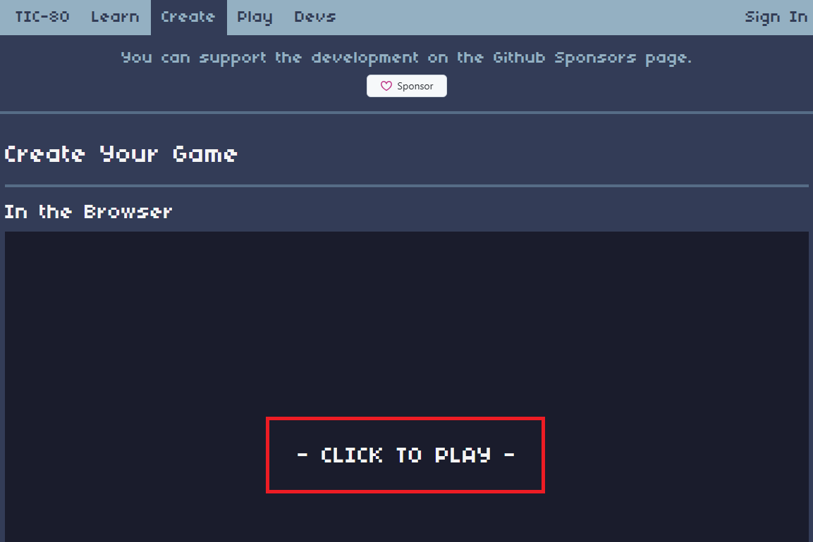
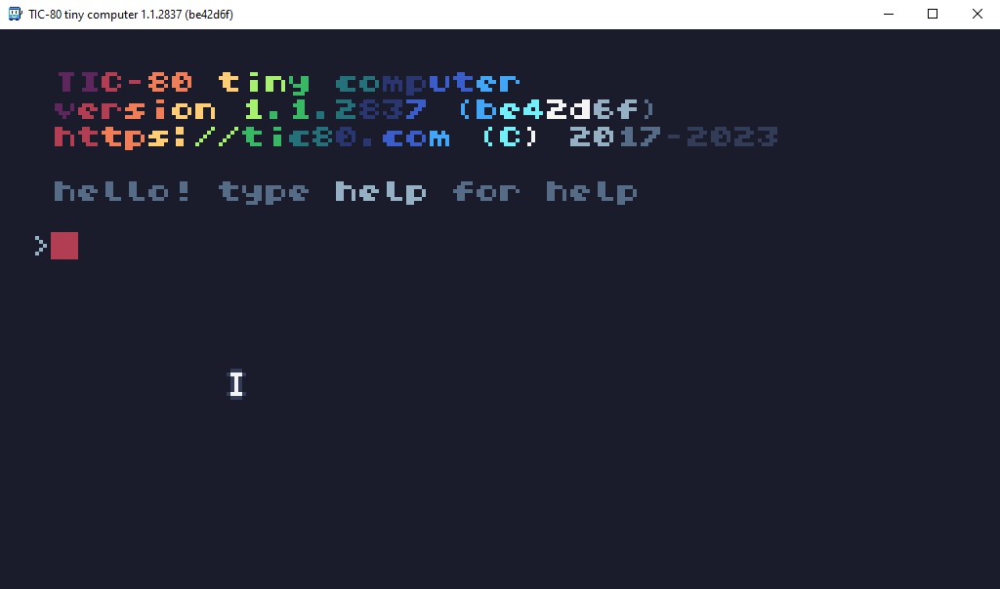
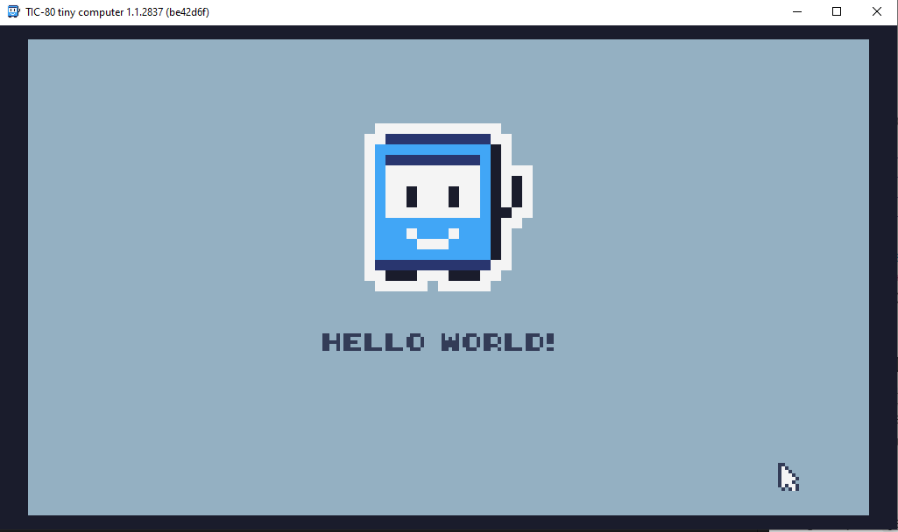
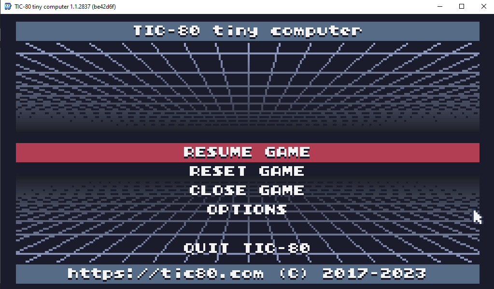
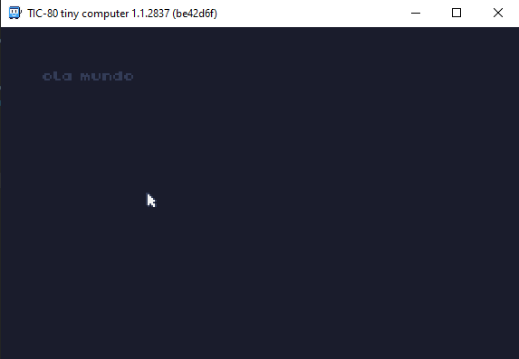
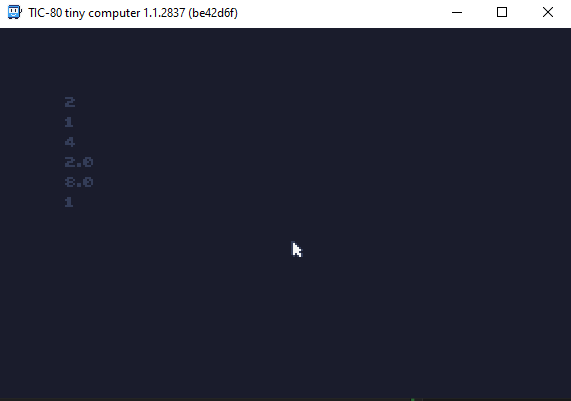
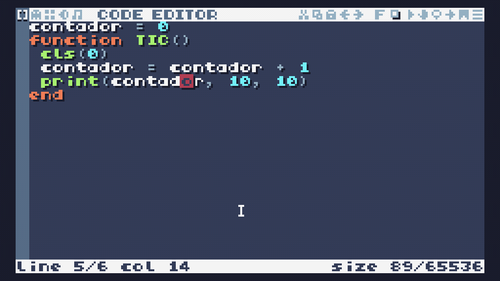
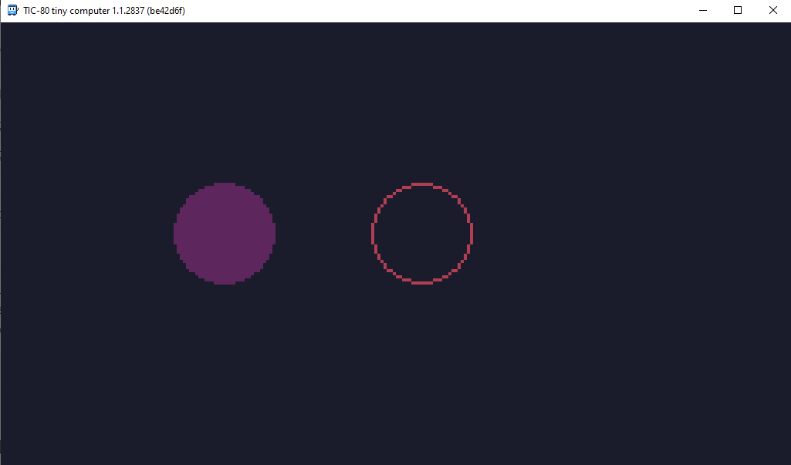

Esse é um tutorial simples sobre o [TIC80](https://tic80.com), um computador de fantasia que te deixa criar jogos de maneira simples

## Oque você vai aprender:
- [Lua](https://www.lua.org/manual/5.1/pt/manual.html) Basico (Variaveis, funçoes, loops e condicionais)
- Usando o basico do tic80 (funçoes de terminal)
- callbacks do TIC80 (`TIC()`,`BOOT()`)
- funçoes de desenho (`cls()`, `print()`, `circ()`, `rect()`, `spr()`)
- funçoes de input (`btn()`, `btnp()`)
- funçoes de mapa (`map()`, `mget()`, `mset()`)

## Oque você vai precisar:
- [TIC80](https://tic80.com/create) (Inclue o editor e o emulador)
- Um celular ou computador

## Como abrir o tic80:
Existem varias maneiras de usar o TIC80, você pode usar o site ou o aplicativo, eu recomendo o aplicativo por ser mais facil de usar e ter suporte a CTRL+C e CTRL+V alem de manter os arquivos salvos no seu dispositivo

### Usando o site:
1. Abra o site do [TIC80](https://tic80.com/create)
2. Clique no botão `CLICK TO PLAY`


### Usando o aplicativo:
1. Abra o site do [TIC80](https://tic80.com/create)
2. desça a pagina até achar a area de Downloads
3. Baixe o aplicativo para o seu dispositivo, Windows, Mac, Linux, Android (IOS não é suportado)
4. Se o arquivo estiver em um zip, extraia ele

## Usando o basico do TIC80:
Ao abrir o TIC80, você verá uma interface assim:


Se você digitar `help` no terminal você verá algumas categorias para ajuda, como `version`, `api`, `buttons`, `keys`, etc...
para ver a ajuda de uma categoria, digite `help CATEGORIA` (ex: `help api`)

## Criando o seu primeiro cartucho:
Para cria um novo cartucho digite `new lua` no terminal, isso criará um novo cartucho com a lingua de programação lua, você receera a seguinte mensagem:
```
new cart has been created
```
Agora você pode começar a programar, digite `edit` ou aperte `[ESC]` para abrir o editor, você verá um codigo assim:
```lua 
(...)

t=0
x=96
y=24

function TIC()

	if btn(0) then y=y-1 end
	if btn(1) then y=y+1 end
	if btn(2) then x=x-1 end
	if btn(3) then x=x+1 end

	cls(13)
	spr(1+t%60//30*2,x,y,14,3,0,0,2,2)
	print("HELLO WORLD!",84,84)
	t=t+1
end
```

Aperte `[CTRL]+[R]` para rodar o codigo, você verá um personagem se movendo na tela, você pode usar as setas para mover o personagem


Agora aperte `[ESC]` para abrir o menu, você verá varias opções como `RESUME GAME`, `RESET GAME`, `CLOSE GAME` e `OPTIONS`, você pode usar as setas para navegar e `[ENTER]` para selecionar


## Introdução a Lua: sintaxe basica
Lua é uma linguagem de programação simples e poderosa, ela é usada em varios jogos e programas, ela é uma linguagem de script, oque significa que você não precisa compilar o codigo, você pode simplesmente escrever e rodar.
Porem agora vamos finalmente programar, abra o terminal e digite `new lua` para criar um novo cartucho, agora digite `edit` para abrir o editor, você verá o mesmo codigo de antes, apague tudo e escreva o seguinte codigo:
```lua
function TIC()
    cls(0) -- limpa a tela
    print("ola mundo") -- escreve "ola mundo" na tela
end
```
Aperte `[CTRL]+[R]` para rodar o codigo, você verá "ola mundo" na tela, dessa maneira:


### Agora vamos explicar o codigo:
Todo programa do TIC80 PRECISA da função `TIC()`, essa funçao roda 60 vezes por segundo, ela é o coração do seu jogo, tudo que está entre ela e o `end` é executado 60 vezes por segundo.
- `cls(0)` limpa a tela, é oque faz o fundo preto atrás do texto
- `print("ola mundo")` escreve "ola mundo" na tela

Agora, tente editar os codigos, mude o texto para outra coisa como "ola amigos" ou "ola tic80", porem lembre se que qualquer texto deve estar entre aspas. Ou mude o numero da função `cls()` para mudar a cor do fundo, você pode usar qualquer numero de 0 a 15. 

## Aprendendo mais sobre as funçoes
Vamos aprender um pouco mais sobre as funçoes, vamos descobrir mais sobre a função `print()`, abra o terminal e digite `help print`, você verá a seguinte mensagem:
```	
print(text x=0 y=0 color=15 fixed=false 
scale=1 smallfont=false) -> width
(...)
```
Porem, oque isso siginifica? Esses são os **Parametros** da função `print()`, parametros são valores que você passa para a função, você já usou um desses parametros, o primeiro, chamado `text` ele é o texto que deve ser desenhado, os outros parametros são opcionais, porem dão mais controle sobre a função, vamos testar o parametro `x` e `y`, abra o editor e escreva o seguinte codigo:
```lua	 
function TIC()
	cls(0) -- limpa a tela
	print("ola mundo", 10, 10) -- escreve "ola mundo" na tela na posição 10, 10
end
```
Aperte `[CTRL]+[R]` para rodar o codigo, você verá "ola mundo" escrito em uma posição diferente, tente editar esses dois valores e veja oque acontece.

## Operadores matematicos
Lua tem varios operadores matematicos, os mais comuns são `+`, `-`, `*`, `/`, `^` e `%`, vamos aprender um pouco sobre eles, abra o editor e escreva o seguinte codigo:
```lua
function TIC()
	cls(0) -- limpa a tela
	print(1+1, 10, 10) -- escreve 2 na tela
	print(2-1, 10, 20) -- escreve 1 na tela
	print(2*2, 10, 30) -- escreve 4 na tela
	print(4/2, 10, 40) -- escreve 2 na tela
	print(2^3, 10, 50) -- escreve 8 na tela
	print(5%2, 10, 60) -- escreve 1 na tela
end
``` 
Ao rodar, você deve obter esse resultado:


Não se preocupe, irei explicar oque está acontecendo:

1. Na linha 3, `print(1+1, 10, 10)` está somando **1 mais 1** e escrevendo o resultado na tela, o resultado é **2**, os outros parametros são a posição do texto na tela
2. Na linha 4, `print(2-1, 10, 20)` está subtraindo **2 menos 1** e escrevendo o resultado na tela, o resultado é **1**
3. Na linha 5, `print(2*2, 10, 30)` está multiplicando **2 vezes 2** e escrevendo o resultado na tela, o resultado é **4**
4. Na linha 6, `print(4/2, 10, 40)` está dividindo **4 dividido por 2** e escrevendo o resultado na tela, o resultado é **2**
5. Na linha 7, `print(2^3, 10, 50)` está elevando **2 a terceira potencia (2 ao cubo)** e escrevendo o resultado na tela, o resultado é **8**
6. Na linha 8, `print(5%2, 10, 60)` está pegando o **resto da divisão de 5 por 2** e escrevendo o resultado na tela, ele primeiro tenta dividir 5 por 2, o resultado é 2 com resto 1, então ele pega o resto e escreve na tela, que é **1**

### Desafio:
Agora que você entendeu os operadores matematicos, tente fazer algumas operações, descubra quanto é **127*61** apenas usando o tic 80, aqui está um codigo para te ajudar:
```lua
function TIC()
	cls(0) -- limpa a tela
	print(2+2, 10, 10) -- escreve o resultado de 127*61 na tela
end
```
<div id="acertou"> Digite uma resposta para ver se você acertou </div>
<input type="text" id="resposta" placeholder="Resposta">
<button onclick="
if(document.getElementById('resposta').value == 7747){
	document.getElementById('acertou').innerHTML = 'Parabens, você acertou!'
}else{
	document.getElementById('acertou').innerHTML = 'Tente novamente'
}
">Verificar</button>

## Variaveis
Variaveis são tipo "caixinhas" que guardam valores, você pode usar esses valores em qualquer lugar do seu codigo, vamos ver um exemplo para situações uteis dela:
```lua
function TIC()
	print("ola mundo", 10, 10)
	print("ola mundo", 10, 20)
	print("ola mundo", 10, 30)
	print("ola mundo", 10, 40) 
end
```
Vamos supor que você quer mudar o texto de todos os `print()`, você teria que mudar todos os textos, um por um, se já é chato mudar 4, imagina umas 100 linhas de codigo, é ai que as variaveis entram, você pode guardar o texto em uma variavel e usar ela em todos os `print()`, vamos ver um exemplo:
```lua
function TIC()
	texto = "ola mundo"
	print(texto, 10, 10)
	print(texto, 10, 20)
	print(texto, 10, 30)
	print(texto, 10, 40) 
end
```
Esse codigo faz a mesma coisa que o anterior, porem é mais facil de editar, você só precisa mudar o texto uma vez, tente mudar o texto da variavel `texto` e veja o resultado.

### Guardar valores
Os valores de variaveis são uteis não só para reutilizar em varios lugares, mas tambem para guardar valores que podem mudar, como a posição de um personagem, a vida de um inimigo, etc... Por enquanto, vamos fazer um exemplo simples, um contador que aumenta varias vezes por segundo
```lua
contador = 0
function TIC()
	cls(0) -- limpa a tela
	contador = contador + 1
	print(contador, 10, 10)
end
```
Primeiramente, antes de usar uma variavel, nós temos que **declarar** ela, basicamente estamos falando para o computador "Ei, eu vou usar uma variavel chamada `contador`, então se prepare", a declaração de variaveis é feita assim:
```lua
nome_da_variavel = valor
``` 

Depois disso, falamos para o computador criar a variavel antes de rodar a função `TIC()`, agora, a variavel `contador` é criada e tem o valor de `0`, na função `TIC()`, estamos falando para o computador calcular quanto é `contador + 1` e guardar o resultado na variavel `contador`, isso terá o efeito de aumentar o contador em 1 a cada vez que a função `TIC()` rodar, veja a tabela explicando
| Rodada | Valor de contador | Contador + 1 | Oque acontece |
|--|--|--|--|
| 1 | 0 | 0 + 1 = 1 | contador = 1 |
| 2 | 1 | 1 + 1 = 2 | contador = 2 |
| 3 | 2 | 2 + 1 = 3 | contador = 3 |
| 4 | 3 | 3 + 1 = 4 | contador = 4 |

E após isso, finalmente estamos escrevendo o valor de `contador` na tela, tente rodar o codigo e veja o contador aumentando, desta maneira:


### Testes interessantes
Agora que você viu o contador funcionando, vamos fazer alguns testes e analizar o resultado, tente fazer esses testes:
1. Mude o valor de `contador` para `contador = contador + 2`, oque acontece?
2. Mude o valor de `contador` para `contador = contador - 1`, oque acontece?
3. Mude o valor de `contador` para `contador = contador * 2`, oque acontece?
4. Mude o valor de `contador` para `contador = contador / 2`, oque acontece?

Ou alguns testes sobre o proprio funcionamento do programa
1. Declare a variavel dentro da função `TIC()`, oque acontece?
2. Não declare a variavel, oque acontece?
3. Remova a linha `contador = contador + 1`, oque acontece?
4. Remova a linha `cls(0)`, oque acontece?

## Mais funções de desenho: `cls()`
Nós vimos a função `cls()` e `print()`, porem bem por cima, agora vamos se aprofundar mais nessas funçoes, vamos começar com a função `cls()`, veja a documentação dela digitando `help cls` no terminal:
```
---=== API ===---
cls(color=0)
```	
| Parametro | Descrição | Valor padrão |
|--|--|--|
| `color` | Cor do fundo para ser pintada | `0` |

Essa função limpa a tela, porem, ela tem um parametro, `color`. Nos exemplos anteriores, nós usamos `cls(0)`, porem você pode mudar o valor para mudar a cor do fundo, tente mudar o valor de `cls()` e veja o resultado, aqui está um exemplo:
```lua
function TIC()
	cls(1) -- limpa a tela com a cor 1
end
```
No TIC80, as cores são representadas por numeros, de 0 a 15, cada numero representa uma cor, aqui está uma tabela com as cores e seus numeros:
| Numero | Cor |
|--|--|
| `0` | Preto ou Transparente |
| `1` | Roxo |
| `2` | Vermelho |
| `3` | Laranja |
| `4` | Amarelo |
| `5` | Verde Claro |
| `6` | Verde |
| `7` | Verde Escuro |
| `8` | Azul Escuro |
| `9` | Azul |
| `10` | Azul Claro |
| `11` | Ciano |
| `12` | Branco |
| `13` | Cinza Claro |
| `14` | Cinza |
| `15` | Cinza Escuro |

Teste mudar o valor de `cls()` e veja o resultado, tente usar numeros de 0 a 15

### Testes interessantes
1. Agora tente colocar numeros maiore que 15, oque acontece?
2. Coloque numeros negativos, oque acontece?
3. Coloque numeros decimais, oque acontece?
4. Coloque letras, oque acontece?

### Desafio
Vamos fazer um desafio, tente fazer um codigo que muda a cor do fundo a cada segundo, lembre dessas coisas:
- A função `TIC()` roda 60 vezes por segundo
- A função `cls()` muda a cor do fundo
- Se você passar um numero decimal para a função `cls()`, ele vai arredondar para o numero inteiro mais proximo
- se você passar um numero mais que 15 ou menos que 0, ele vai ser convertido para 0 ou 15 respectivamente
- Você pode usar variaveis para guardar valores

Aqui está um codigo para te ajudar:
```lua
contador = 0 -- Cria a variavel contador
function TIC()
	contador = contador + 1 -- Aumenta o contador
	cls(contador/60) -- Muda a cor do fundo
end
```

## Mais funções de desenho: `print()`
Agora vamos falar sobre a função `print()`, essa função é usada para escrever texto na tela, veja a documentação dela digitando `help print` no terminal:
```
---=== API ===---
print(text x=0 y=0 color=15 fixed=false
scale=1 smallfont=false) -> width
```
| Parametro | Descrição | Valor padrão |
|-----------|-----------|--------------|
| `text`    | Texto a ser escrito | `""`  |
| `x`       | Posição X do texto | `0`   |
| `y`       | Posição Y do texto | `0`   |
| `color`   | Cor do texto | `15` (Cinza escuro)  |
| `fixed`   | Se o texto deve ser fixo | `false`  |
| `scale`   | Escala do texto | `1`  |
| `smallfont` | Se o texto deve ser pequeno | `false`  |

Antes, nós usamos apenas os parametros `text`, `x` e `y`, porem, agora, vamos usar o parametro `color`, para mudar a cor do texto, tente mudar o valor de `color` e veja o resultado, aqui está um exemplo:
```lua
cor = 1
function TIC()
	-- escreve "ola mundo" na posição 10, 10 com a cor 1 (Roxo)
	print("ola mundo", 10, 10, cor) 
end
```
Teste mudar o valor de `cor` e veja o resultado, tente usar numeros de 0 a 15

## Mais funções de desenho: `circ()`
Agora vamos finalmente ver uma função nova, a função `circ()`, essa função é usada para desenhar circulos, veja a documentação dela digitando `help circ` no terminal:
```
---=== API ===---
circ(x y radius color)
```
| Parametro | Descrição | Valor padrão |
|-----------|-----------|--------------|
| `x`       | Posição X do circulo | Nenhuma |
| `y`       | Posição Y do circulo | Nenhuma |
| `radius`  | Raio do circulo | Nenhuma |
| `color`   | Cor do circulo | Nenhuma |

Essa função desenha um circulo na tela, ela tem 4 parametros, `x` e `y` são a posição do circulo, `radius` é o raio (tamanho) do circulo e `color` é a cor do circulo, **todas esses parametros são obrigatorios** e devem ser passados na ordem certa, tente fazer um circulo na tela, aqui está um exemplo:
```lua
function TIC()
	cls(0) -- limpa a tela
	circ(64, 64, 32, 1) -- desenha um circulo na posição 64, 64 com raio 32 e cor 1 (Roxo)
end
```

### A função `circb`
A função `circb()` é parecida com a função `circ()`, porem, ela desenha apenas a borda do circulo, veja o exemplo:
```lua
function TIC()
	cls(0) -- limpa a tela
	circ(64, 64, 16, 1) -- desenha um circulo na posição 64, 64 com raio 32 e cor 1 (Roxo)
	circb(128, 64, 16, 2) -- desenha a borda do circulo na posição 64, 64 com raio 32 e cor 2 (Vermelho)
end
```


## Mais funções de desenho: `rect()`
Agora vamos ver a função `rect()`, essa função é usada para desenhar retangulos, veja a documentação dela digitando `help rect` no terminal:
```
---=== API ===---
rect(x y w h color)
```
| Parametro | Descrição | Valor padrão |
|--|--|--|
| `x` | Posição X do retangulo | Nenhuma |
| `y` | Posição Y do retangulo | Nenhuma |
| `w` | Largura do retangulo | Nenhuma |
| `h` | Altura do retangulo | Nenhuma |
| `color` | Cor do retangulo | Nenhuma |

Essa função desenha um retangulo na tela, ela tem 5 parametros, `x` e `y` são a posição do retangulo, `w` é a largura do retangulo, `h` é a altura do retangulo e `color` é a cor do retangulo, **todas esses parametros são obrigatorios** e devem ser passados na ordem certa, tente fazer um retangulo na tela:
```lua
x = 32
y = 32
w = 64	
h = 32

function TIC()
	cls(0) -- limpa a tela
	rect(x, y, w, h, 1) -- desenha um retangulo na posição 32, 32 com largura 64, altura 32 e cor 1 (Roxo)
end
```

## condicionais
Condicionais, ou "ifs" são uma das bases da programação, eles são usados para fazer decisões, como "Se a vida do jogador for menor que 0, então ele morreu", ou "Se o jogador apertar o botão "A", ele pula", vamos ver um exemplo simples de um if:
```lua
vida = 100
function TIC()
	if vida > 0 then
		print("O jogador esta vivo", 10, 10)
	end
end
```
Antes de qualquer coisa, temos que analisar a sintaxe do if, ele é feito assim:
```lua
if CONDIÇÃO then
	-- codigo
end
```
O if começa com a palavra chave `if`, seguido de uma condição (como `vida > 0`), depois disso, temos a palavra chave `then`, que indica que o bloco de codigo do if começou, depois disso, temos os codigos que irão ser rodados se a condição for verdadeira, depois temos a palavra chave `end`, que indica que o bloco de codigo do if terminou, se a condição for falsa, o codigo dentro do if é ignorado.

Agora voltando para o codigo anterior, rode ele, vocé verá "O jogador está vivo" na tela, pois no if, verificamos se `vida` é maior que 0, e como `vida` é 100, a condição é verdadeira, então o codigo é rodado, agora tente mudar o valor de vida para outro valor, como 0 por exemplo, e veja o resultado.

### O uso do `else`
O `else` é usado para rodar um bloco de codigo se a condição do if for falsa, dessa maneira:
```lua
if CONDIÇÂO then
	-- codigo da condição verdadeira
else
	-- codigo da condição falsa
end
```
Agora vamos editar o codigo anterior para usar o `else`:
```lua
vida = 100
function TIC()
	if vida > 0 then
		print("O jogador esta vivo", 10, 10)
	else
		print("O jogador morreu", 10, 10)
	end
end
```
Agora, se a vida for maior que 0, ele escreve "O jogador está vivo", se não, ele escreve "O jogador morreu", tente mudar o valor de vida e veja o resultado.

## Operadores Logicos Matematicos
No ultimo codigo, nós utilizamos o operador `>` (maior que), porem ele não é o unico operador logico, existem varios outros, veja a tabela dos principais
| Operador | Descrição | Exemplo | Resultado |
|--|--|--|--|
| `>` | Maior que | `5 > 3` | Verdadeiro |
| `>=` | Maior ou igual a | `5 >= 5` | Verdadeiro |
| `<` | Menor que | `5 < 3` | Falso |
| `<=` | Menor ou igual a | `5 <= 3` | Falso |
| `==` | Igual a | `5 == 3` | Falso |
| `~=` | Diferente de | `5 ~= 3` | Verdadeiro |

vamos fazer um exemplo simple para testar esses operadores e variaves:
```lua
x = 5
y = 3
function TIC()
	cls(0) --não se esqueça de limpar a tela

	if x > y then --condição
		print("x e maior que y", 10, 10) --codigo se a condição for verdadeira
	end
	if x < y then --condição
		print("x e menor que y", 10, 20) --codigo se a condição for verdadeira
	end
	if x == y then --condição
		print("x e igual a y", 10, 30) --codigo se a condição for verdadeira
	end
	if x ~= y then --condição
		print("x e diferente de y", 10, 40) --codigo se a condição for verdadeira
	end

end
```
Tente mudar os valores de `x` e `y` e veja o resultado, tente usar elses tambem para testar o codigo

### Desafio
Agora que você entende condicionais e operadores logicos e funçoes de desenho, tente fazer um codigo que desenha um circulo, que vai para a direta, e quando ele chegar no final da tela, ele volta para o começo, lembre se dessas coisas:
1. A largura da tela é `240px`
2. A função `circ()` desenha um circulo e tem os parametros `(x, y, raio, cor)`
3. para somar um valor a uma variavel, você pode usar `variavel = variavel + valor`
4. para mover algo para a **direita** você aumenta o seu `x`, para mover para a **esquerda** você diminui o seu `x`
5. Se o circulo passar do final da tela, você pode usar um if para mudar a posição dele para o começo da tela
6. Lembre-se de definir as variaveis **FORA** da função `TIC()`

> [!WARNING]
> A seguir está uma solução para o desafio, tente fazer o desafio antes de ver a solução, a melhor maneira de aprender é tentando, porem sé precisar de ajuda, a solução está aqui

```lua
x = 0
LARGURA = 240
function TIC()
	cls(0)
	circ(x, 64, 16, 1)
	x = x + 1
	if x > LARGURA then
		x = 0
	end
end
```
O uso da **constante** `LARGURA` é para facilitar a edição do codigo, iremos aprender mais sobre constantes mais tarde.

## Nomes de variaveis e constantes
Nós já aprendemos sobre como usar variaveis, porem algo importante que devemos aprender é como nomear elas de uma maneira que evita erros e deixa o codigo mais facil de entender, aqui estão algumas regras e dicas para nomear variaveis:

#### 1. Não use palavras reservadas
Toda lingua de programação tem palavras reservadas, que são palavras que tem um significado especial para o computador, como o `if` e o `then` por exemplo, imagine o computador tentando entender esse codigo:
```lua
if = 10
then = 20

if if > then then
	--codigo
end
```
O computador não teria ideia doque fazer, pois o `if` e o `then` são palavras reservadas, então **não use palavras reservadas como nomes de variaveis**

#### 2. Não coloque espaços
Espaços são usados para separar palavras, então se você colocar um espaço no nome de uma variavel, o computador vai achar que a segunda palavra é outra variavel ou comando, veja esse exemplo:
```lua
variavel legal = 10
```
O computador vai ler a primeira palavra `variavel` perfeitamente, porem quando ele chegar no espaço, ele vai achar que a variavel acabou, então ele vai tentar ler a palavra `legal` como um comando, e vai dar erro, então **não use espaços no nome de variaveis**

#### 3. CamelCase
As vezes é necessario colocar mais de uma palavra em uma variavel, porem já vimos que isso é impossivel, para isso existe o `CamelCase`, que é uma convenção de nomear variaveis com mais de uma palavra, veja alguns exemplos
| Nome | CamelCase |
|--|--|
| Nome do jogador | `nomeDoJogador` |
| Vida do jogador | `vidaDoJogador` |
| Posição x | `posicaoX` |
| Posição y | `posicaoY` |

O camelCase consiste em juntar todas as palavras e colocar a primeira letra de cada palavra em maiusculo, menos a primeira

#### 4. Nomes curtos e descritivos
A maneira que você nomeia suas variaveis ajuda muito na hora de criar coisas novas, pois mesmo que o computador entenda o codigo, você não vai entender oque ele faz, vamos ver um exemplo de um codigo completamente funcional, porem que ninguem entende:
```lua
v1 = 10
v2 = 20
v3 = 12
v4 = 5
v5 = 240
function TIC()
	v1 = v1 + 1
	if v1 > v5 then
		v1 = 0
	end
	circ(v1, v2, v3, v4)
end
```
Esse codigo é completamente funcional, porem é dificil de entender, talvez você consiga deduzir oque ele faz pelo seu tamanho curto, porem imagina você tentar deduzir variaveis para um codigo com mais que 100 linhas, agora veja o mesmo codigo, porem com variaveis descritivas:
```lua
x = 10
y = 20
raio = 12
cor = 5
larguraTela = 240
function TIC()
	cls(0)
	x = x + 1
	if x > larguraTela then
		x = 0
	end
	circ(x, y, raio, cor)
end
```

Outra coisa para se analizar é o tamanho das variaveis, talvez você pense "Ah, mas eu posso usar `posicaoHorizontalDaBola`, porem imagina ter que escrever essa variavel toda vez que for usar ela, então tente achar um equilibrio entre o tamanho e a descrição da variavel, nesse exemplo, seria bom usar um nome como `x` ou se tiverem multiplas coisas que podem ter um "x" chamar de `bolaX`.

#### 5. Mais regras de nomeação
Existem outras regras de nomeação de variaveis, veja:

1. **Não use acentos ou caracteres especiais** - O computador pode não entender esses caracteres, ou achar que um asterisco, por exemplo, é um simbolo de multiplicação, então por isso não use caracteres especiais (`ç á é ã @ # $ % & *`)

2. **Não use numeros no começo** - O computador pode achar que você está tentando fazer uma operação matematica, então não use numeros no começo de uma variavel (`1vida`, `2nome`, `3x`)

#### 6. Constantes
Constantes são como variaveis, caixinhas que armazenam valores, porem elas são **constantes**, ou seja, ao contrario das variaveis, que são feitas para ter seu valor mudado varias vezes, as constantes são feitas para ter seu valor fixo, que é raramente ou nunca editado, para o computador variaveis e constantes são a mesma coisa, porem para o programador, elas tem um significado diferente, veja um exemplo de uma constante:
```lua
LARGURA_TELA = 240
function TIC()
	cls(0)
	print("A largura da tela e ", 10, 10)
	print(LARGURA_TELA, 10, 20)
end
```
Para facilitar o reconhecimento delas, as constantes são nomeadas completamente em maiusculo, usando Underline(`_`) para separar palavras, isso é uma convenção, não uma regra, porem é bom seguir ela, pois ajuda a diferenciar variaveis de constantes

Porem você deve estar pensando, quando é util usar constantes? Bem, constantes são uteis para valores que são usados varias vezes no codigo, como a largura da tela, a altura da tela, cores, etc... Porem, constantes são uteis para valores que são usados em varios lugares, pois se você precisar mudar o valor, você só precisa mudar em um lugar, e não em varios, veja um exemplo:
```lua
LARGURA_TELA = 240
ALTURA_TELA = 136
COR_FUNDO = 0
function TIC()
	cls(COR_FUNDO)
end
```
Se você precisar mudar a cor do fundo, você só precisa mudar o valor de `COR_FUNDO`, e não em todos os `cls()`, isso é util para evitar erros e facilitar a edição do codigo

Outro lugar que é util para constantes, neste caso especificamente para o TIC80 são as cores, pois as cores são representadas por numeros, e é dificil lembrar o numero de cada cor, então é bom usar constantes para isso, veja um exemplo:
```lua
PRETO = 0
ROXO = 1
VERMELHO = 2
LARANJA = 3
AMARELO = 4
VERDE_CLARO = 5
(...)

function TIC()
	cls(PRETO)
	rect(10, 10, 40, 30, AMARELO)
end
```
Dessa maneira, você pode usar o nome da cor ao inves do numero, oque deixa o codigo mais facil de entender, porem, você pode usar numeros se quiser, porem é bom usar constantes para facilitar a leitura do codigo

## Interação do jogador
Você provavelmente deve estar se perguntando "ok, eu sei como desenhar coisas, sei como verificar condições, porem como que eu faço meu jogo ser um jogo?", A resposta é interação do jogador, no TIC80 você tem 3 metodos de interação:

1. **Botões** - O TIC80 tem 8 botões, `cima`,`baixo`,`esquerda`,`direita`,`A`,`B`,`X` e `Y`, no celular, esses botões aparecem na tela, no computador você pode usar seu teclado para simular eles.

2. **Teclado** - Você pode usar teclado para interagir com o TIC80, tendo suporte para 94 teclas

3. **Mouse** - Você pode usar o mouse para interagir tambem, no celular você usa o mouse clicando na tela

Agora vamos ver com mais detalhe como usar essas interações

## Botões
Como já visto antes, o TIC80 tem 8 botões, veja a lista deles e como apertar eles usando o teclado:
| Botão | Tecla |
|--|--|
| `cima` | `[↑]` |
| `baixo` | `[↓]` |
| `esquerda` | `[←]` |
| `direita` | `[→]` |
| `A` | `[Z]` |
| `B` | `[X]` |
| `X` | `[A]` |
| `Y` | `[S]` |

Para usar esses botões, nós usamos a função `btn()`, veja a documentação dela digitando `help btn` no terminal:
```
---=== API ===---
btn(id) -> pressed
```
| Parametro | Descrição | Valor padrão |
|--|--|--|
| `id` | ID do botão | Nenhuma |

Essa função retorna se um botão especifico está sendo apertado, ela tem um parametro, `id`, que é o ID do botão que você quer verificar, para ver a tabela dos botões digite `help buttons` no terminal:

| Ação | P1 | P2 | P3 | P4 |
|--|--|--|--|--|
| `Cima` | 0 | 8 | 16 | 24 |
| `Baixo` | 1 | 9 | 17 | 25 |
| `Esquerda` | 2 | 10 | 18 | 26 |
| `Direita` | 3 | 11 | 19 | 27 |
| `A` | 4 | 12 | 20 | 28 |
| `B` | 5 | 13 | 21 | 29 |
| `X` | 6 | 14 | 22 | 30 |
| `Y` | 7 | 15 | 23 | 31 |

Esses são os IDs que iremos usar para verificar se um botão está sendo apertado, vamos ver como isso funciona:
```lua
function TIC()
	cls(0)
	if btn(0) then
		print("Cima esta sendo apertado", 10, 10)
	end
end
```
Nesse codigo, nós estamos verificando se o botão `0` (cima) está sendo apertado, já que iremos rodar o codigo **se** o botão estiver sendo apertado, nós usamos um `if`, agora rode o programa e tente apertar `[↑]`.

Uma dica util quando você está usando botões, é usar constantes para os IDs, ao invez de escrever `if btn(0) then`, você pode escrever `if btn(BTN_CIMA)` por exemplo, isso deixa o codigo mais facil de entender, veja um exemplo:
```lua
BTN_CIMA = 0
BTN_BAIXO = 1
BTN_ESQUERDA = 2
BTN_DIREITA = 3

function TIC()
	cls(0)
	if btn(BTN_CIMA) then
		print("Cima esta sendo apertado", 10, 10)
	end
end
```

### Exemplo pratico
vamos fazer um exemplo pratico, onde controlamos um circulo usando as setas do teclado, veja o codigo:
```lua
CIMA = 0
BAIXO = 1
ESQUERDA = 2
DIREITA = 3

x = 64
y = 64

function TIC()
	cls(0)
	if btn(CIMA) then
		y = y - 1 -- diminui o y para subir
	end
	if btn(BAIXO) then
		y = y + 1 -- aumenta o y para descer
	end
	if btn(ESQUERDA) then
		x = x - 1 -- diminui o x para ir para a esquerda
	end
	if btn(DIREITA) then
		x = x + 1 -- aumenta o x para ir para a direita
	end
	circ(x, y, 16, 1)
end
```
nós usamos as constantes para os IDs de botões para facilitar a leitura do codigo, e usamos um `if` para verificar se o botão está sendo apertado

### `btnp()`
Você ja conhece a função `btn()`, porem, ela tem um problema, ela retorna `true` sempre que o botão está sendo apertado, por exemplo, no codigo antigo, o codigo de movimentação era rodado 60 vezes por segundo, para mover para os lados isso é util, porem vamos pensar em um jogo de tiro, se você segurar o botão de tiro, o tiro sairia 60 vezes por segundo.
Então para isso temos a função `btnp()`: 
```
---=== API ===---
btnp(id hold=-1 period=-1) -> pressed
```
| Parametro | Descrição | Valor padrão |
|--|--|--|
| `id` | ID do botão | Nenhuma |
| `hold` | Tempo que o botão deve ser apertado | `-1` |
| `period` | Tempo entre os apertos | `-1` |

Primeiramente, vamos usar essa função apenas com o primeiro parametro, veja:
```lua
DIREITA = 3

x = 64

function TIC()
	cls(0)
	if btnp(DIREITA) then
		x = x + 5
	end
	circ(x, 64, 16, 1)
end
```
Nesse codigo, nós estamos verificando se o botão `DIREITA` foi apertado, e se foi, nós movemos o circulo para a direta, porem, o circulo só se move uma vez, mesmo que você segure o botão, isso é util para ações que devem ser feitas uma vez, como pular, atirar ou abrir um menu.

Agora vamos ver os dois outros parametros, `hold` e `period`, os dois andam lado a lado, se não tiver um, o outro não funciona.
Eles servem para ter um efeito parecido com o teclado, onde se você segurar um botão, ele repete a ação, teste nessa caixa de texto:
<textarea> </textarea>
veja que quando você segura uma tecla, ela demora um pouco para começar a repetir, e depois ela repete a ação varias vezes, é mais ou menos isso que o `hold` e `period` fazem, veja um exemplo:
```lua
DIREITA = 3

x = 64
function TIC()
	cls(0)
	-- delay de 30frames (0.5 segundos)
	-- e repete a cada 5 frames (0.083 segundos)
	if btnp(DIREITA, 30, 5) then
		x = x + 5
	end
	circ(x, 64, 16, 1)
end
```
Nesse codigo, nós estamos verificando se o botão `DIREITA` foi apertado, e se foi, nós movemos o circulo para a direta, porem, depois de um tempo, ele começa a se mover rapidamente, similar ao exemplo do teclado repetindo as teclas

## Teclado (`key()` e `keyp()`)s
A maneira que o teclado funciona é bem parecida com os botões, só que agora, ao invez de ter 8 ids, temos **94**.
Para ver a tabela dos IDs, digite `help keys` no terminal, veja a tabela:
Essa é uma tabela apenas com as letras do alfabeto
|Codigo|Tecla|Codigo|Tecla|
|--|--|--|--|
| 1 | A | 14 | N |
| 2 | B | 15 | O |
| 3 | C | 16 | P |
| 4 | D | 17 | Q |
| 5 | E | 18 | R |
| 6 | F | 19 | S |
| 7 | G | 20 | T |
| 8 | H | 21 | U |
| 9 | I | 22 | V |
| 10 | J | 23 | W |
| 11 | K | 24 | X |
| 12 | L | 25 | Y |
| 13 | M | 26 | Z |

Para usar esse codigos fazemos a mesma coisa que com os botões veja:
```lua
function TIC()
	cls(0)
	if key(1) then
		print("A esta sendo apertado", 10, 10)
	end
end
```
Quando usamos teclados, é comum tambem, usar constantes para os IDs, veja um exemplo:
```lua
W = 23
A = 1
S = 19
D = 4

x = 64
y = 64

function TIC()
	cls(0)
	if key(W) then
		y = y - 1
	end
	if key(S) then
		y = y + 1
	end
	if key(A) then
		x = x - 1
	end
	if key(D) then
		x = x + 1
	end
	circ(x, y, 16, 1)
end
```
Nesse codigo, nós controlamos um circulo usando **WASD**, veja que é bem parecido com os codigos dos botões.

### `keyp()`
Não irei explicar muito sobre essa função, pois ela é bem parecida com a `btnp()`, porem, ela é usada para teclados, veja a documentação dela:
```
---=== API ===---
keyp(key hold=-1 period=-1) -> pressed
```
| Parametro | Descrição | Valor padrão |
|--|--|--|
| `key` | ID da tecla | Nenhuma |
| `hold` | Tempo que a tecla deve ser apertada | `-1` |
| `period` | Tempo entre os apertos | `-1` |

A mesma coisa que o `btnp()`, porem para teclados, veja um exemplo:

## Mouse (`mouse()`)
A função mouse é diferente das outras funções de interação, ao invez de chamarmos ela com algum parametro, nós simplesmente chamamos ela e ela retorna todos os valores que iremos precisar
```
---=== API ===---
mouse() -> x y left middle right 
scrollx scrolly
```
Iremos usar uma tabela diferente, ao invez dos parametros, vamos listar os retornos dela
| Retorno | Descrição |
|--|--|
| `x` | Posição X do mouse |
| `y` | Posição Y do mouse |
| `left` | Se o botão esquerdo do mouse está sendo apertado |
| `middle` | Se o botão do meio do mouse está sendo apertado |
| `right` | Se o botão direito do mouse está sendo apertado |
| `scrollx` | Movimento horizontal do scroll do mouse |
| `scrolly` | Movimento vertical do scroll do mouse |

Vamos fazer um exemplo simples, onde criamos um circulo que segue o mouse
```lua
function TIC()
	cls(0)
	-- Pegamos os dois primeiros retornos
	-- que são a posição X e Y do mouse
	mx,my = mouse()

	-- Desenhamos um circulo na posição do mouse
	circ(mx, my, 16, 1)
end
```
(colocar imagem aqui)
Veja que nós pegamos os dois primeiros retornos da função `mouse()`, e usamos esses valores para desenhar o circulo.
Agora, vamos fazer um exemplo mais complexo, onde criamos um circulo que segue o mouse, porem, ele só se move se o botão esquerdo do mouse estiver sendo apertado
```lua
-- Posições do circulo
x = 64
y = 64

function TIC()
	cls(0)
	-- Pegamos os três primeiros retornos
	-- que são a posição X e Y e se o botão esquerdo do mouse está sendo apertado
	mx,my,mLeft = mouse()

	-- Se o botão esquerdo do mouse estiver sendo apertado
	if mLeft then
		-- Movemos o circulo para a posição do mouse
		x = mx
		y = my
	end

	-- Desenhamos um circulo na posição do mouse
	circ(x, y, 16, 1)
end
```
Veja que agora, estamos pegando mais um valor da função `mouse()`, que é se o botão esquerdo do mouse está sendo apertado, nós guardamos esse valor na variavel `mLeft` (eu acho interessante chamar as variaveis do mouse com nomes que começam com `m` para facilitar) e depois usamos ela no `if`para verificar se temos que mover o circulo até o mouse


A função mouse não possue uma versão de apertar uma vez, como o `btnp()` e o `keyp()`.

## Desafio
Agora que você aprendeu sobre interação com botões, teclado e mouse, crie um jogo onde você controla 3 circulos:
- O primeiro circulo é controlado pelas setas do teclado
- O segundo circulo é controlado pelas letras `WASD`
- O terceiro circulo é controlado pelo mouse, e só se move se o botão esquerdo do mouse estiver sendo apertado

Lembre-se dessas coisas:
1. Use constantes para os IDs dos botões e teclas, para os botões use constantes com nomes tipo `BTN_CIMA`, para as teclas use constantes com nomes tipo `KEY_W`
2. Use variaveis para guardar as posições dos circulos, aconcelho usar nomes tipo `x1`, `y1`, `x2`, `y2`, `x3`, `y3`
3. Use `if` para verificar se os botões estão sendo apertados
4. Não esqueca de usar `cls(0)` para limpar a tela

> [!WARNING]
> A seguir está uma solução para o desafio, tente fazer o desafio antes de ver a solução, a melhor maneira de aprender é tentando, porem sé precisar de ajuda, a solução está aqui

```lua
BTN_CIMA = 0
BTN_BAIXO = 1
BTN_ESQUERDA = 2
BTN_DIREITA = 3

KEY_W = 23
KEY_A = 1
KEY_S = 19
KEY_D = 4

x1 = 64
y1 = 64

x2 = 128
y2 = 64

x3 = 192
y3 = 64

function TIC()
	cls(0)
	-- Circulo controlado pelas setas
	if btn(BTN_CIMA) then
		y1 = y1 - 1
	end
	if btn(BTN_BAIXO) then
		y1 = y1 + 1
	end
	if btn(BTN_ESQUERDA) then
		x1 = x1 - 1
	end
	if btn(BTN_DIREITA) then
		x1 = x1 + 1
	end

	-- Circulo controlado pelas letras WASD
	if key(KEY_W) then
		y2 = y2 - 1
	end
	if key(KEY_S) then
		y2 = y2 + 1
	end
	if key(KEY_A) then
		x2 = x2 - 1
	end
	if key(KEY_D) then
		x2 = x2 + 1
	end

	-- Circulo controlado pelo mouse
	mx,my,mLeft = mouse()
	if mLeft then
		x3 = mx
		y3 = my
	end

	circ(x1, y1, 16, 1)
	circ(x2, y2, 16, 2)
	circ(x3, y3, 16, 3)
end
```
Este é um exemplo de como você pode fazer o desafio, se seu codigo ficou diferente está ok, cada programador programa de uma maneira, apenas se atente se seu codigo:
1. Funciona
2. É facil de entender
3. Não tem erros

## Tipos de Variaveis
Até agora, nós estamos tratando todas as variaveis da mesma maneira, porem, existem alguns **tipos** de variaveis, que são usadas para guardar diferentes tipos de dados, como numeros, texto, etc... Vamos ver os tipos de variaveis mais comuns:
1. **Numero**: Variaveis que guardam numeros, como `1`, `2`, `3.14`, `-10`, etc. Você só pode fazer contas usando esse tipo de variavel
2. **Texto**: As chamadas `strings`, são variaveis que guardam texto, como `"Olá"`, `"Mundo"`, `"TIC80"`, etc. Você não pode fazer contas com esse tipo de variavel
3. **Booleano**: Variaveis que guardam `true` ou `false`, são usadas nos `if` para verificar condições, como `vida >0` ou `btn(BTN_CIMA)` ou `mLeft`
4. **Tabela**: Variaveis que guardam varios valores, iremos aprender mais sobre elas.
5. **nulo**: Variaveis que não tem valor, são usadas para dizer que uma variavel não tem valor

> Para ver o tipo de uma variavel, você pode usar a função `type()`, que retorna o tipo da variavel:
```lua
numero = 10
texto = "Olá"
booleano = true
tabela = {1, 2, 3} --- veremos mais sobre tabelas mais tarde
nulo = nil -- veremos mais sobre nulos depois

function TIC()
	cls(0)
	print(type(numero), 10, 10)
	print(type(texto), 10, 20)
	print(type(booleano), 10, 30)
	print(type(tabela), 10, 40)
	print(type(nulo), 10, 50)
end
```
A saida desse codigo será
```
number
string
boolean
table
nil
```

Agora vamos ver mais sobre cada tipo de variavel
### Numeros
Numeros são os tipos de variaveis mais comuns, eles são usados para fazer contas, guardar posições, etc...
```lua
numero = 10
numero2 = 3.14
numero3 = -5
```
você pode fazer contas com numeros, como soma, subtração, multiplicação e divisão, veja um exemplo:
```lua
numero = 10
numero2 = 5
resultado = numero + numero2 -- 15
resultado2 = numero - numero2 -- 5
resultado3 = numero * numero2 -- 50
resultado4 = numero / numero2 -- 2
```

Nós ja vimos quase tudo sobre numeros, porem, existe uma coisa que ainda não vimos, que é a ordem das operações, veja um exemplo:
```lua
resultado = 10 + 5 * 2
```
Você pode pensar que o resultado é `30` (somamos **10** com **5** e depois multiplicamos por **2**), porém, **Lua** segue as ordem das operações.
Nesse caso, primeiro calculariamos `5 * 2`, que é `10`, e depois somariamos `10 + 10`, que é `20`, então o resultado é `20`.

Para mudar a ordem das operações, você pode usar parenteses, veja:
```lua
resultado = (10 + 5) * 2
```
Nesse caso, primeiro somariamos `10 + 5`, que é `15`, e só depois multiplicariamos por `2`, que é `30`, então o resultado é `30`.

### Texto

As variaveis de texto são chamadas de strings, e são usadas para guardar textos, por enquanto apenas usamos elas para desenhar textos especificos, porem elas tamem podem ser alteradas como os numeros, veja um exemplo:
```lua
nome = "João"

function TIC()
	cls(0)
	print("Olá, meu nome é "..nome, 10, 10)
end
```
Esse codigo ira escrever, "Olá, meu nome é João" meu nome é Renan, porem, você pode mudar o valor de `nome` para qualquer coisa, tente mudar o valor de `nome` para **outro texto** e veja o resultado
Agora tente mudar para um numero, veja o resultado
Ocorreu um erro, isso é porque você não pode **Concatenar** (juntar) um numero com um texto.

Porem vamos pensar mais no sinal `..` ele é usado para **concatação** de duas strings, isso faz com que se você tente concatenar um numero com um texto, um erro acontecerá, para isso usamos uma função chamada `tostring()` que converte um numero para uma string:
```lua
texto = "Ola"
numero = 10

textoJunto  = texto..numero -- ERRO (não podemos concatenar strings com numeros)

textoJunto = texto..tostring(numero) -- "Ola10"
```

Tipicamente juntamos textos usando concatenação (`..`), porem as vezes usar concatenação fica muito feio e dificil de entender:
```lua	
texto = "Ola, eu sou "..nome.." e tenho "..idade.." anos"
```
Para resolver isso, podemos usar **formatação de strings**, que é uma maneira de juntar textos e variaveis de uma maneira mais facil de entender:
```lua
texto = string.format("Ola, eu sou %s e tenho %s anos", nome, idade)
```
Nesse caso, `%s` é um **placeholder**, (um lugar onde você coloca algo), e o `string.format()` é uma função que **formata** a string, substituindo os placeholders em ordem pelos valores que você passa depois:
```lua
function TIC()
	cls(0)
	mx,my = mouse()
	texto = string.format("O mouse esta em %s, %s", mx, my)
	print(texto, 10, 10)
end
```
A saida desse codigo será algo como `O mouse esta em 12, 32`, onde `12` e `32` são as posições do mouse

> Existem outros placeholders, como `%d` para numeros, `%f` para numeros com ponto flutuante, `%x` para numeros em hexadecimal, nós tipicamentes usamos o %s pois ele converte qualquer coisa para uma string

### Booleanos
Booleanos são variaveis que guardam `true` ou `false`, você pode achar que isso é inutil, porem eles servem para verificar condições, nós ja usamos eles nos nossos ifs, como `if btn(BTN_CIMA) then`, onde se estiver sendo apertado, ele retorna `true`, se não, ele retorna `false`, veja alguns exemplos de booleanos:
```lua
verdade = true
mentira = false
verifica = 10 > 5 -- true
verifica2 = 10 < 5 -- false

DESENHAR_FUNDO = true
```


