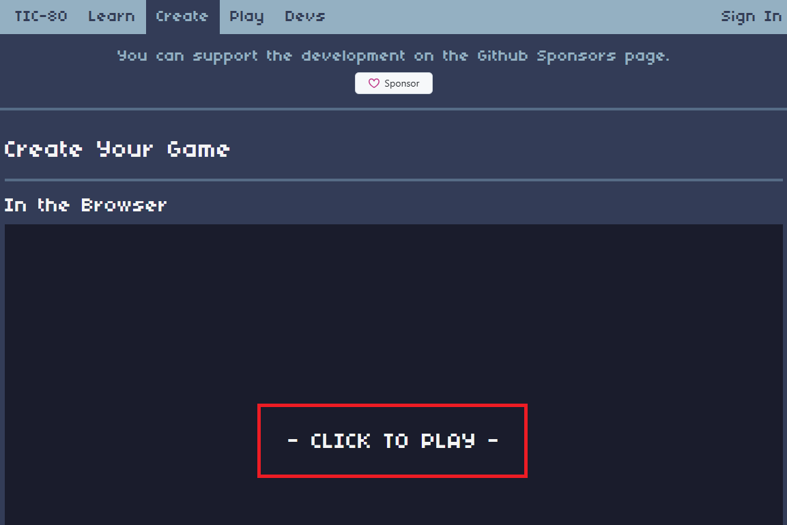

Esse é um tutorial simples sobre o [TIC80](https://tic80.com), um computador de fantasia que te deixa criar jogos de maneira simples

## Oque você vai aprender:
- [Lua](https://www.lua.org/manual/5.1/pt/manual.html) Basico (Variaveis, funçoes, loops e condicionais)
- Usando o basico do tic80 (funçoes de terminal)
- callbacks do TIC80 (`TIC()`,`BOOT()`)
- funçoes de desenho (`cls()`, `print()`, `circ()`, `rect()`, `spr()`)
- funçoes de input (`btn()`, `btnp()`)
- funçoes de mapa (`map()`, `mget()`, `mset()`)

## Oque você vai precisar:
- [TIC80](https://tic80.com/create) (Inclue o editor e o emulador)
- Um celular ou computador

## Como abrir o tic80:
Existem varias maneiras de usar o TIC80, você pode usar o site ou o aplicativo, eu recomendo o aplicativo por ser mais facil de usar e ter suporte a CTRL+C e CTRL+V alem de manter os arquivos salvos no seu dispositivo

### Usando o site:
1. Abra o site do [TIC80](https://tic80.com/create)
2. Clique no botão `CLICK TO PLAY`

### Usando o aplicativo:
1. Abra o site do [TIC80](https://tic80.com/create)
2. desça a pagina até achar a area de Downloads
3. Baixe o aplicativo para o seu dispositivo, Windows, Mac, Linux, Android (IOS não é suportado)
4. Se o arquivo estiver em um zip, extraia ele

